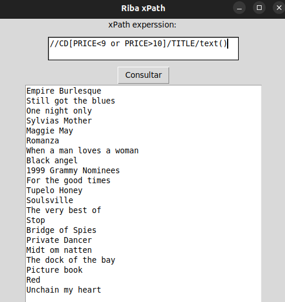

# Activitats:

1. Fes un programa amb interfície gràfica que tingui un entry, un botó i un label:
  - A Entry es podrà escriure un query XPath.
  - Quan pressionem el botó es farà la consulta a la bbdd i es mostrarà el resultat al label.
  - Si la consulta dona error s'avisarà amb un text al label.
  - Formatejar la sortida XML.

2. Utilitzant el fitxer [cd_catalog.xml](cd_catalog.xml):
  - Afegeix el fitxer a la col·lecció MP06UF3.
  - Crea les següents consultes (captura del teu programa amb el query i el resultat):
    - Mostra els títols dels CDs de Tina Turner.
    ~~~
    //CD[ARTIST='Tina Turner']/TITLE/text()
    ~~~
    

        
    

    - Mostra els artistes dels CDs de la EU.
    ~~~
    //CD[COUNTRY='UK']/ARTIST/text()
    ~~~
    

        
    

    - Mostra els artistes dels CDs que no siguin de la EU.
    ~~~
    //CD[COUNTRY!='UK']/ARTIST/text()
    ~~~
    

        
    

    - Mostra el títol concatenat amb l'any dels CDs de Andrea Bocelli.
    ~~~
    concat(//CD[ARTIST='Andrea Bocelli']/TITLE/text()," ",//CD[ARTIST='Andrea Bocelli']/YEAR/text())
    ~~~
    

        
    

    - Mostra els títols dels CDs anteriors a 1990.
    ~~~
    //CD[YEAR<1990]/TITLE/text()
    ~~~
    

        
    

    - Mostra els títols dels CDs de 1990 o posteriors.
    ~~~
    //CD[YEAR>=1990]/TITLE/text()
    ~~~
    

        
    

    - Mostra els títols dels CDs que tinguin un preu inferior a 9 o superior a 10.
    ~~~
    //CD[PRICE<9 or PRICE>10]/TITLE/text()
    ~~~
    

        
    

    - Mostra els títols dels CDs que tinguin un preu inferior a 10 i superior a 9.
    ~~~
    //CD[PRICE<10 or PRICE>9]/TITLE/text()
    ~~~
    

        
    

    - Mostra els artistes dels CDs de la companyia EMI.
    ~~~
    //CD[COMPANY='EMI']/ARTIST/text()
    ~~~
    

        
    

